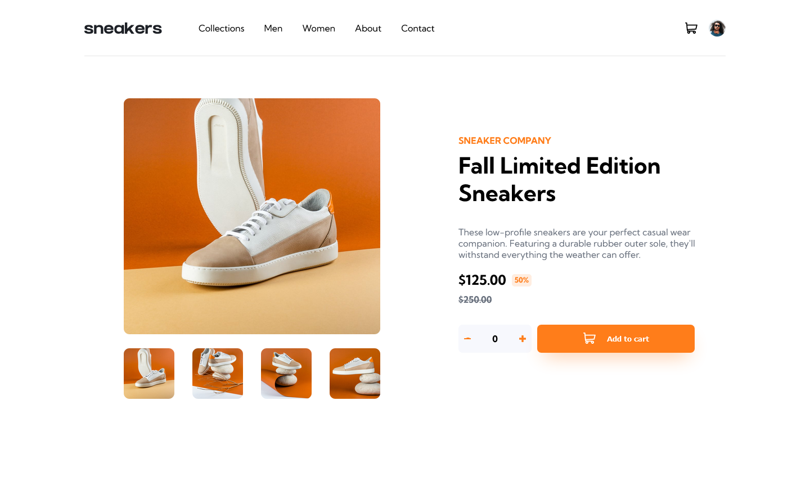

# Frontend Mentor - E-commerce product page solution

This is a solution to the [E-commerce product page challenge on Frontend Mentor](https://www.frontendmentor.io/challenges/ecommerce-product-page-UPsZ9MJp6). Frontend Mentor challenges help you improve your coding skills by building realistic projects.

## Table of contents

- [Overview](#overview)
  - [The challenge](#the-challenge)
  - [Screenshot](#screenshot)
  - [Links](#links)
- [My process](#my-process)
  - [Built with](#built-with)
  - [What I learned](#what-i-learned)
  - [Continued development](#continued-development)
- [Author](#author)

## Overview

### The challenge

Users should be able to:

- View the optimal layout for the site depending on their device's screen size
- See hover states for all interactive elements on the page
- Open a lightbox gallery by clicking on the large product image
- Switch the large product image by clicking on the small thumbnail images
- Add items to the cart
- View the cart and remove items from it

### Screenshot

### Links

- Solution URL: [Add solution URL here](https://your-solution-url.com)
- Live Site URL: [Add live site URL here](https://your-live-site-url.com)

## My process

### Built with

- Semantic HTML5 markup
- CSS custom properties
- Flexbox
- CSS Grid
- Mobile-first workflow

### What I learned

Working on this project reinforced the major concepts of web development using vanilla javascript, CSS and HTML. CSS Grid and Flexbox featured heavily in this design, and using them has taught me many more tips and tricks in getting designs done. Having to problem solve and come up with solutions, especially using Javascript was a very rewarding experience.

Above all, working on this priject has made me more confident as a web developer as well as put the foundational concepts of HTML, CSS, and Javascript at my fingertips. I look forward to deepening my knowledge, broadening my horizon, and taking on more challenging designs after this one. Also, I look forward to mastering a frontend development framework like REACT so as to greatly increase my efficiency.

### Continued development

Creating this design from scratch with nothing but the design assets and getting it perfectly has been a huge morale boost for me. As such, more than ever, I am ctrongly driven to continue my development as a web developer. My next major project would be to create an even more complex design that will push my coding skills to the limit. I also hope to master REACT soon and begin to use it to create even greater projects.

## Author

- Website - [Kachi Ugo](https://github.com/kachiugo3)
- Twitter - [@KachiUgo](https://twitter.com/KachiUgo)
